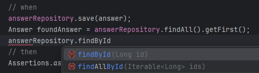
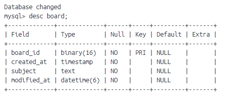

> 작성일: 2024-02-07  
> Written By: [ClayCat](https://github.com/claycat)

> Devdalus 프로젝트의 Java ORM JPA 연동 분투기입니다  
  JPA 학습과 병행하며 고민한 포인트들을 정리하였습니다

## Custom Repository
* 일반적으로 JPA를 사용하여 특정 도메인에 대한 레포지토리 클래스를 작성하면  
  아래와 같이 사용합니다
```java
public interface BoardRepository extends JpaRepository<Board, Long> {}
```
* 제네릭의 두번째 인자는 어떤것인가? 항상 Long인가? `<Board, Long>`
    * `JpaRepository<T, ID>`는 `Repository<T, ID>`를 상속받으며, 제네릭 인자는 다음과 같습니다
        * T : 레포지토리가 관리하는 도메인 타입
        * ID: 레포지토리가 관리하는 도메인 타입의 ID의 타입 
    * 이때 ID는 어떤걸 의미하는걸까요?   
        * 테이블의 PK로 UUID를 설정하였다면 해당값은 UUID타입을 줘야 할까요?
    * 결과
        * Long으로 설정했을 때 findAll()등의 메소드에는 영향이 없지만,  
          findById()의 타입추론이 Long으로 이루어지는것을 볼 수 있었습니다
    * 결론: Entity의 ID타입과 동일하게 제네릭의 두번째 타입을 설정하자

## Annotation
* 생성 일자를 기록하기 위한 칼럼 애노테이션 - `@CreatedDate` vs `@CreationTimeStamp`
    1. 두 애노테이션의 차이는? 어떤 것을 골라야 할까?
        * `@CreatedDate`
            * *Spring* 애노테이션
            * @EnableJpaAuditing과 @EntityListeners 애노테이션 명시 필요
        * `@CreationTimeStamp`
            * *Hibernate* 애노테이션
        * JPA의 구현체를 변경했을 때 종속성이 없는 스프링 애노테이션을 사용하였습니다
    2. 애노테이션이 실제 MySQL상의 데이터타입과 어떤 연관이 있을까?
        * `@CreatedDate`와 `@CreationTimeStamp`는 MySQL의 매핑 타입과는 관여하지 않습니다
        * 오히려 타입인 LocalDateTime이 직접적인 영향을 끼치는데,  
          JPA의 구현체인 Hibernate가 내부적으로 **LocalDateTime을 MySQL의 DATETIME으로** 매핑합니다.  
          물론, 여전히 dialect의 버전에 따라 세부 내용은 변경될 수 있습니다.
        
        * 명시적으로 지정하고 싶다면?
            * ColumnDefinition을 사용할 수 있습니다.
            * `@Column(name = "created_at", columnDefinition = "TIMESTAMP")`
            * 실제로 명시적으로 지정하지 않은 테이블의 속성은 datetime으로 지정되어있는것을 확인할 수 있습니다  
            
