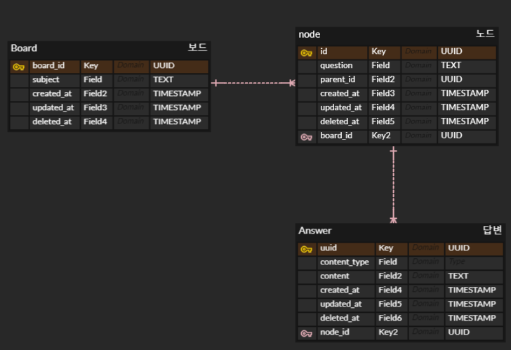

> 작성일: 2024-02-07  
> Written By: [ClayCat](https://github.com/claycat)

> Devdalus 프로젝트의 Java ORM JPA 연동 문서입니다

{: .note}
현재 MVP 목표상 유저가 등장하지는 않기 때문에 제외하고 테이블을 구상하였습니다

## 요구사항 적어보기
* 하나의 보드(=주제) 
    * 하나의 주제는 Root Node의 역할을 함
* Root node에는 일반 노드들을 추가할 수 있음
    * 추가한 일반 노드는 "꼬리질문" 개념
* 꼬리질문에는 추가적인 꼬리질문을 달 수 있음
* 노드(질문)에는 답변을 달 수 있음

## RDB vs NoSQL?
* 직관적으로 생각하면 하나의 주제는 일종의 Nested Structure로 구성됨
    * 그렇다면 NoSQL을 사용하는게 어떨까?
        * 몽고DB류는 많은 읽기에 적합
        * 우리의 서비스에는 "읽기"가 더 많이 일어날까? "쓰기"가 더 많이 일어날까?
            * 초기에는 "쓰기", 점점 "읽기" 가 많아질 것

* 나중에 DB가 병목이라면 NoSQL을 읽기전용으로 구성할수있나?
* RDB로도 충분히 표현이 가능
    * 일단 먼저 RDB를 사용한 디자인 
    * 추후 유저 테이블이 추가된다면 RDB가 확장성에서 유리할 듯

## 테이블 설계
* **핵심 포인트**
    * 이후 권한 관련 (공개/비공개) 설정을 고려하여 PK를 UUID로 설정하였습니다
        * PK를 예측가능한 int 형으로 설정하게 되면 보안상 좋지 않다고 생각하였습니다
    * 특정 노드에서 자식 노드들을 쿼리할 수 있도록 부모 노드를 칼럼으로 보유합니다 

## 진행된 토의와 질문들 정리
* **TIMESTAMP** vs DATETIME
    * [Laravel: Datetime vs Timestamp - Differences](https://laraveldaily.com/post/laravel-datetime-vs-timestamp-differences)
    * TIMESTAMP 선택 이유
        * timestamp 가 더 용량이 적음 (DateTime = 8byte, TimeStamp = 4Byte)
        * 시스템 시간에 따라 시간대가 변경
            * 서빙하는 경우에도 어차피 국내 AWS 인스턴스 사용예정
            * 글로벌 서비스를 지향한다면 고려해볼 수 있을 듯.
            * index 생성시 더 빠르다 (검증 필요)

* Root Node 결정방식
    * (꼬리질문)자식 노드들은 부모 노드의 id를 칼럼으로 보유하지만,
    (주제)루트 노드의 경우에는 해당 값이 비어있음
    * 여기서 두가지 선택지
        * 노드 테이블의 parent_id 칼럼을 nullable로 설정
        * 별도의 칼럼을 두고, 루트 노드인지 아닌지 표시
    * 어떤것을 선택해야 하는가?
        * 마이그레이션 고려하면 nullable 처리하기 어렵지 않을까?
            * 반박 - MySQL, PostGreSQL 대부분의 RDBMS는 모두 nullable 칼럼을 지원
        * Nullable 칼럼은 인덱스를 탈 수 있는가? 
            * [가능](https://dev.mysql.com/doc/refman/8.0/en/is-null-optimization.html)
* Answer 테이블의 Content_Type
    * 현재 요구사항은 아니지만, 추후 plain text가 아닌 markdown 형식 또한 고려할 예정
    * 질문 - 어차피 백엔드 입장에서는 TEXT일뿐인데, 고려해야할 이유가 있는가?
        * 반박 - 있다! 프론트엔드에서 띄워줄 때는 결국 데이터의 형식을 알아야 하기 때문에 트래킹할 필요가 있다