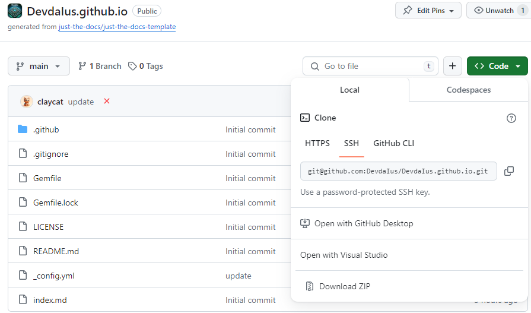

# **위키 포스팅 작성법**
작성일: 2024-01-31

Devdalus github blog는 [just-the-docs](https://github.com/just-the-docs/just-the-docs) 테마를 사용하고 있습니다.  
<br>

> ## 해당 문서에서 다루는 것
* 기본적인 포스팅 작성법을 안내드립니다.  
* 작성한 글을 로컬 서버에서 확인하는 방법을 설명합니다

> ## 해당 문서에서 다루지 않는 것
* 자세한 커스터마이징 방법은 [공식문서](https://just-the-docs.com/)를 참고하시기 바랍니다
* Markdown 문서 작성법은 [관련 자료](https://gist.github.com/ihoneymon/652be052a0727ad59601)를 참고하시기 바랍니다

<br>

## 1. Github 레포지토리 Clone 하기    

우선 블로그를 호스팅하는 레포지토리를 Clone 합니다  




## 2. 글 작성하기

* 레포지토리 내부에 docs 디렉토리가 있습니다.  
* docs 디렉토리 안에 .md(Markdown) 확장자의 파일을 하나 생성합니다.  
    * 파일의 위치가  해당 문서의 URL 이 됩니다.   
    (ex: /docs/backend.md → https://devdaius.github.io/docs/backend)
* 작성하고자 하는 내용을 작성합니다
    * 이 때 최상단에 아래 내용을 추가합니다  
        ```
        ---
        layout: default
        title: 글 제목
        nav_order: 글이 왼쪽 글목록에 보여질 우선순위
        ---
        ```
* add - commit - push 를 수행합니다
* 적용될때까지 기다린 뒤 직접 접속해 글이 잘 올라갔나 확인합니다

## 3. 로컬 서버에서 확인하기

작성한 글이 레이아웃이 괜찮은지 확인하기 위해 매번 commit - push 를  
반복하는건 상당히 귀찮습니다.  
<br>
로컬에서 블로그를 구동시켜서 작성한 글을 실시간으로 확인하는 방법을 소개드리겠습니다.

### 3-1. 로컬 서버 실행
터미널에서 clone 한 레포지토리로 들어갑니다.  
아래 명령어를 수행합니다
```C
bundle install //오류 발생할 경우 ruby 설치 확인할것
bundle exec jekyll serve --livereload  //--livereload 명령어는저장할때마다 웹사이트가 자동으로 새로고침
```

<br>
둘 중 하나로 들어가서 작성하고 있는 Markdown 파일을 확인할 수 있습니다.  

{: .warning}
로컬 환경이기때문에 작성을 완료했다면 **commit & push**까지 해야 실제 업로드가 완료됩니다!
