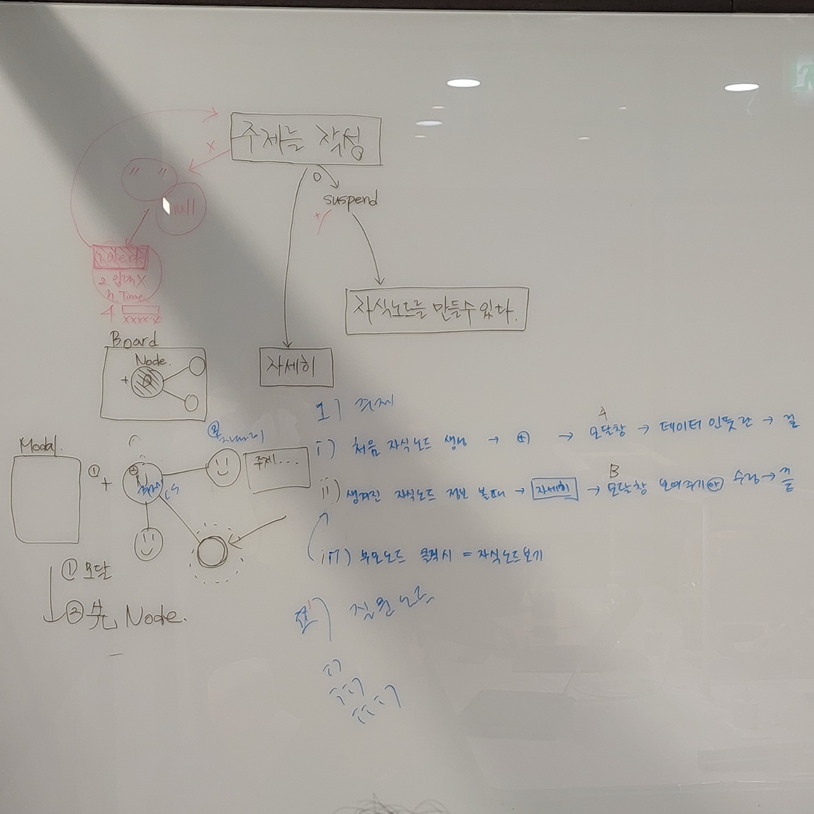
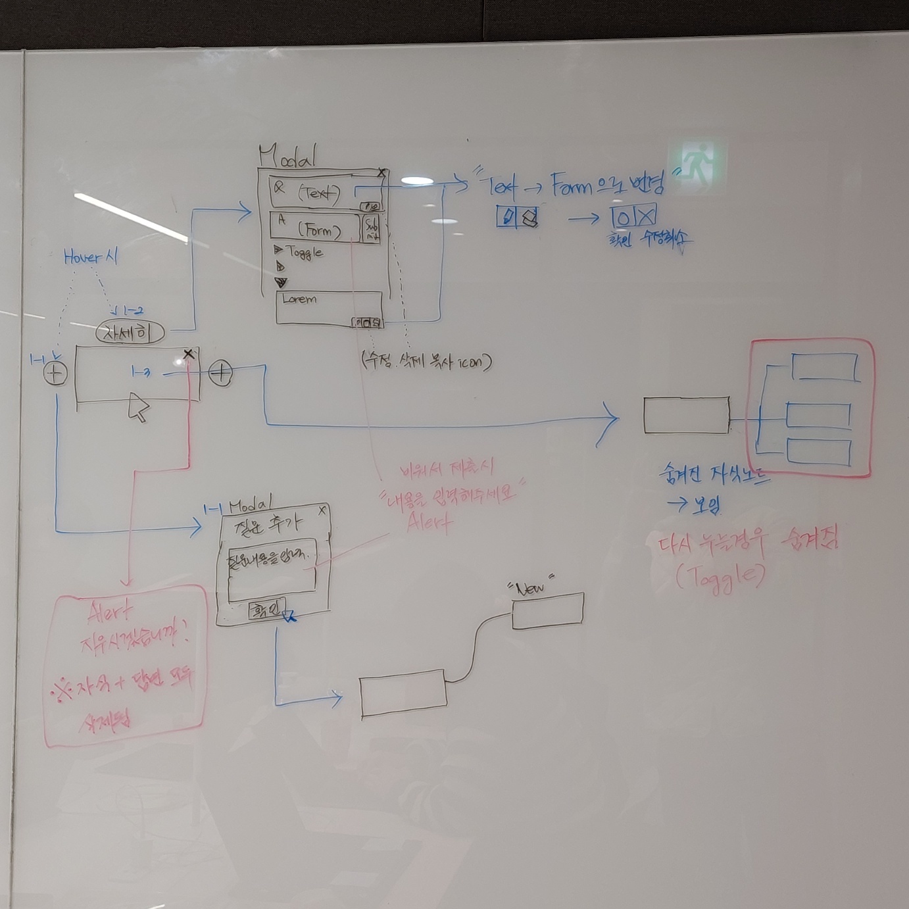

> 작성일: 2024-01-25  
> Written By: [ClayCat](https://github.com/claycat)

> Devdalus 프로젝트 두번째 정기 미팅입니다
> 장소: 오프라인 (강남취창업센터)  
> 참석자 : 장수길, 김라온, 박성훈,  노소희

## 지난번에 이어서
* 초반 디자인 협의 회의
    * 헤더에 검색창 추가
        * 디자인적으로만 미리 구성, 기능개발에는 미포함
    * 메인페이지 주제 추가란에 있는 돋보기 

## 용어 통일
* board: node가 생성되는 공간
* node: 질문 + 답변

## 기능 정의
* "+" 버튼 : 자식 노드 생성
* 자식 보기(노드)클릭시 : 이전에 만들어 놓은 자식 노드들 등장(?)
* 자세히 보기 : 해당 노드의 질문과 답변 모달 창

## 함께 구상한 기능표 
* 모두 함께 화이트보드에서 기능들을 리스트업하고
* 상호작용에 대해서 Sync를 맞춰주었습니다

## 백엔드 태스크 목록
* SpringBoot로 만들기 - 0.5
* JPA 연동 (Hibernate) - 2
* CI - 4 
    * 빌드체크 
    * 테스트 (조사) 
* Docker Compose (개발환경 세팅) - 3
    * 개발용 
    * 배포용
* DB ERD 테이블설계 (같이) - 2
수길 : 2, 4
훈 : 1, 3 